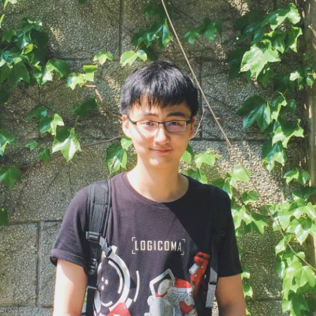

I am working at Department of Computer Vision Technology (VIS) of BAIDU as a computer vision researcher. I received my master degree at Shanghai Jiao Tong University in 2019, advised by Prof. Xu Zhao. I received my B.Eng from School of Mechanical Engineering at Shanghai Jiao Tong University in 2016. 

My research interests include: GAN, Cross-Modal Generation, Style Transfer, Temporal Action Detection and Action Recognition.

---

<h4>contact</h4>

Tianwei Lin 

Email: wzmsltw@gmail.com  
701 Naxian Road 
Shanghai 
China  

