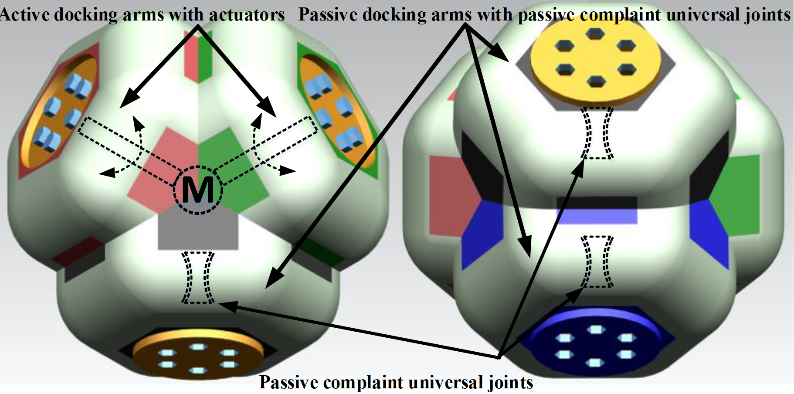

#### 2016

<b>[1]</b> Longhai Zhao, Hao Wang, <b>Tianwei Lin</b>, Genliang Chen, Lingyu Kong. "Conceptual Design and Kinematic Analysis of the Diamobot: A Homogeneous Modular Robot." Advances in Reconfigurable Mechanisms and Robots II. Springer, Cham, 2016. 693-703.  
<td> </td>
---
<td>  </td>