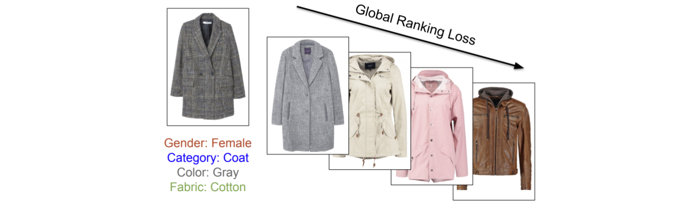
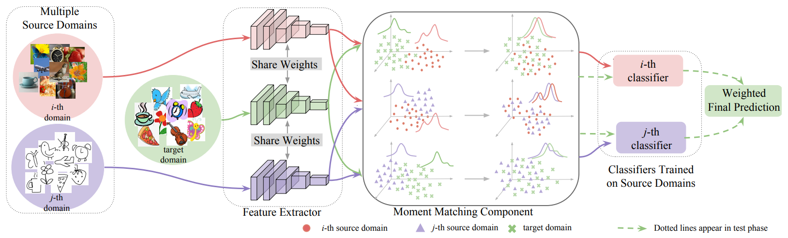
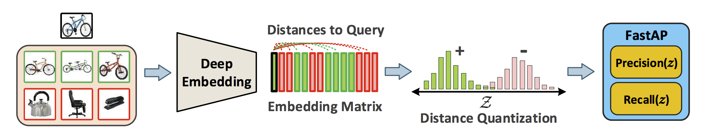
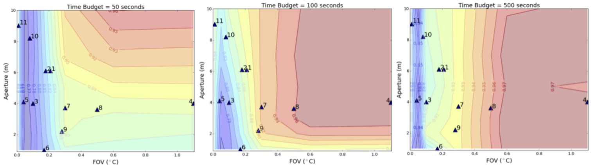
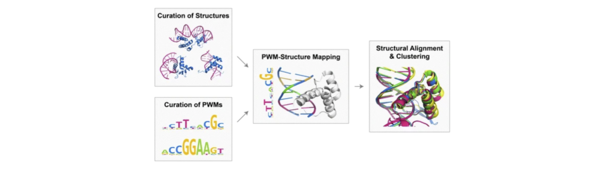

#### 2019
[P.7] <b>Xide Xia</b>, Meng Zhang, Tianfan Xue, Zheng Sun, Hui Fang, Brian Kulis, Jiawen Chen. “Joint Bilateral Learning for
Fast Universal Photorealistic Style Transfer.” Under reviewing. 
<td> </td>
---
<td>  </td>

[P.6] <b>Xide Xia</b>, Kun He, Fatih Cakir, Brian Kulis. “Fashion Retrieval with Fine-Grained Attribute Representation Learning.”
Under reviewing.
<td> </td>
---
<td>  </td>

[P.5] Xingchao Peng, Qinxun Bai, <b>Xide Xia</b>, Zijun Huang, Kate Saenko, Bo Wang. “Moment Matching for Multi-Source
Domain Adaptation.” In Proc. IEEE International Conference on Computer Vision (ICCV) 2019, Oral. 
<td> </td>
---
<td>  </td>

[P.4] Kun He, Fatih Cakir, <b>Xide Xia</b>, Brian Kulis, Stan Sclaroff. “Deep Metric Learning to Rank.” In Proc. IEEE
Conference on Computer Vision and Pattern Recognition (CVPR) 2019.  
<td> </td>
---
<td>  </td>

#### 2017
[P.3] <b>Xide Xia</b>, Brian Kulis. “W-Net: A Deep Model for Fully Unsupervised Image Segmentation.” ArXiv tech report 1711.08506, November 2017.  
<td> </td>
---
<td>  </td>

#### 2016
[P.2] <b>Xide Xia</b>, Finale Doshi-Velez, Pavlos Protopapas. “Cost-Sensitive Batch Mode Active learning: Designing Astronomical Observation by Optimizing Telescope Time and Telescope Choice.” In In Proceedings of SIAM Data Mining Conference (SDM). 2016.   
<td> </td>
---
<td>  </td>

#### 2015
[P.1] AlQuraishi, Mohammed, Shengdong Tang, and <b>Xide Xia</b>. "An affinity-structure database of helix-turn-helix: DNA complexes with a universal coordinate system." BMC bioinformatics 16.1 (2015): 1.  [Data](http://staging.proteindna.hms.harvard.edu/)
<td> </td>

